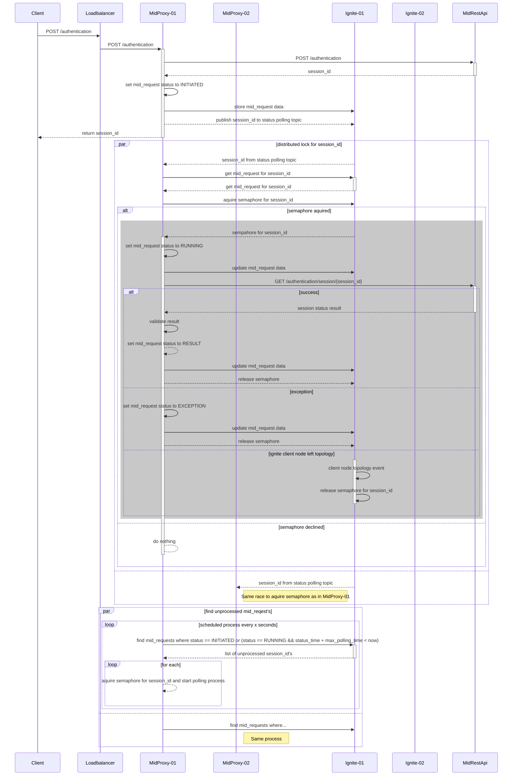

# Mobile ID (MID) REST API proxy service 

A demo application for sharing background jobs using [Apache Ignite](https://ignite.apache.org/docs/latest/) cluster

#### Used features:
- [Topic-Based Messaging](https://ignite.apache.org/docs/latest/messaging) for publishing background job tasks
- [Distributed semaphore](https://ignite.apache.org/docs/latest/data-structures/semaphore) for locking background job for processing
- [Cache Queries](https://ignite.apache.org/docs/latest/key-value-api/using-cache-queries) for finding unprocessed business objects and returning only subset of properties (E.g. background job info)

## Prerequisites
- [mid-rest-mock docker image](https://github.com/aarmam/mid-rest-mock)

## Job sharing process



## Build docker image

```shell
./mvnw spring-boot:build-image
```
## Run docker containers

```shell
docker compose up
```

## Running performance test

```shell
./mvnw gatling:test -DmidRestProxyUrl=http://localhost:8080
```

## Metrics

- [Grafana](http://gafana.localhost:3000/)
- [Prometheus](http://prometheus.localhost:9090/targets)